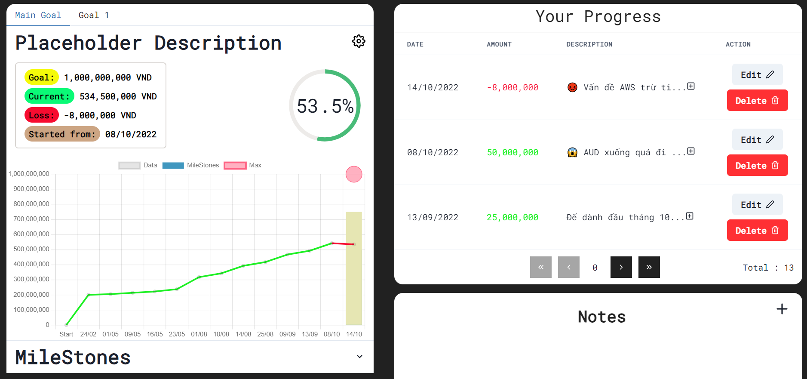

# Saving Goal

A responsive saving app that will show you graph about your current saving amount, your goal.

You can also add meaningful description to each of your step and drag-n-drop notes about the current saving goal.

# Stacks

- React
- Firebase for authentication, cloudFireStore for databases
- Chakra-UI
- JavaScript and TypeScript
- Zustand for state management
- Git version control
- Netlify for deployment

# To-Do List

- [x] Prevent users to create milestones with existing amount
- [x] Allow users to choose color for the milestone when creating it
- [x] Hide milestones dropdown when there are no milestones
- [x] Fixing 0 position incorrectly
- [x] Edit milestones allow to choose color
- [x] Stop user from edit a milestone amount to an existing amount from other milestones
- [x] Unique labels for chart
- [x] Re-confirming user want to delete the milestone
- [x] Can't create more than 5 milestones each goal
- [x] Adding crossover for milestones and check icon if milestones progress >= 100%
- [x] Stop user from creating goal with negative amount, milestones with negative amount
- [x] Testing to see what if totalAmount === goal
- [x] Adding currency ( optional ) for goal and show it in the chart, only allow length of 3, can edit / remove it if wanted
- [x] Table Note drag n drop
- [x] Editable Note on open modal
- [x] Deploying app online [https://cute-seahorse-5d3a81.netlify.app/]
